# 🖥️ Terraform Docker Infra

Simple Infrastructure as Code project for creating a Docker container using Terraform.

---

## 🎯 Project Goal

The goal of this project was to:

PHASE 1  
* practice basic Terraform workflow
* understand how Terraform providers work
* use Terraform to manage Docker resources
* deploy a simple Nginx container with Terraform
* learn the difference between Terraform configuration and real infrastructure
* verify the deployed container locally through `localhost`
 
PHASE 2  
* improve Terraform project structure
* replace hardcoded values with variables
* add Terraform outputs for useful deployment information
* make the project easier to read, maintain and extend

PHASE 3
* serve a custom Cloud/DevOps Knowledge Base webpage through Nginx
* mount local static web files into the Docker container
* replace the default Nginx welcome page with custom web content (my devops overview page)

PHASE 4
* introduce `terraform.tfvars` for local configuration
* customize container name without editing Terraform code directly
* customize exposed port without editing Terraform code directly
* customize Docker image through variable values
* keep local configuration separate from committed project code
* provide `terraform.tfvars.example` as a safe template for GitHub

---

## ⏱️ Project Status

**Status:** Completed – Phase 4  
**Current Phase:** Phase 4 – Parameterization with tfvars  
**Type:** Infrastructure as Code / DevOps Lab  
**Technologies:** Terraform, Docker, Nginx, WSL, VS Code

---

## ⚙️ Features

* Uses Terraform Docker provider
* Pulls the `nginx:latest` Docker image
* Creates a Docker container named `terraform-nginx`
* Maps container port `80` to local port `8080`
* Allows local testing through `http://localhost:8080`
* Demonstrates basic Terraform workflow:
  * `terraform init`
  * `terraform fmt`
  * `terraform validate`
  * `terraform plan`
  * `terraform apply`
  * `terraform destroy`
* Uses separate Terraform files for better structure
* Defines configurable values in `variables.tf`
* Displays useful deployment information through `outputs.tf`
* Serves a custom Cloud/DevOps Knowledge Base webpage through Nginx
* Mounts the local `web/` directory into the Docker container
* Replaces the default Nginx welcome page with personal static web content
* Uses Terraform volume configuration to manage custom web content
* Uses `terraform.tfvars` for local customization
* Provides `terraform.tfvars.example` as a safe configuration template
* Allows changing container name without editing `.tf` files
* Allows changing exposed port without editing `.tf` files
* Allows changing Docker image without editing `.tf` files
---

## 🛠️ Technologies Used

* **Terraform** – Infrastructure as Code tool
* **Docker** – Container platform
* **Nginx** – Web server running inside the container
* **WSL** – Linux environment on Windows
* **VS Code** – Code editor
* **Git & GitHub** – Version control and project hosting

---

## 👍 Pre-requisites

To run this project, make sure you have the following installed:

- Terraform
- Docker
- Git
- WSL, if you are working on Windows
- VS Code, optional but recommended

Check installed versions:

```bash
terraform version
docker version
git --version
```

Check if Docker is running:

```bash
docker ps
```

If Docker is running correctly, this command should return a container list, even if the list is empty.

### 💻 Supported environments

- Linux / macOS / Windows
- WSL (Windows Subsystem for Linux)

---

## 🚀 Installation

```bash
git clone https://github.com/MartinTomcikMT/terraform-docker-infra.git
cd terraform-docker-infra
```

---

## ▶️ How to Run

Format Terraform files:

```bash
terraform fmt
```

Initialize Terraform and download the required Docker provider:

```bash
terraform init
```

Validate Terraform configuration:

```bash
terraform validate
```

Preview what Terraform will create:

```bash
terraform plan
```

Apply the configuration and create the Docker container:

```bash
terraform apply
```

Confirm with:

```text
yes
```

After successful deployment, Terraform displays useful outputs:

```text
application_url = "http://localhost:8080"
container_name  = "terraform-nginx"
image_name      = "nginx:latest"

Verify that the container is running:

```bash
docker ps
```

Test the Nginx web server:

```bash
curl http://localhost:8080
```

Or open in browser:

```text
http://localhost:8080
```

Destroy the created infrastructure:

```bash
terraform destroy
```

Confirm with:

```text
yes
```

---

## 🚀 How It Works

1. Terraform reads the configuration from multiple `.tf` files.
2. `main.tf` defines the Docker image and Docker container resources.
3. `variables.tf` defines configurable values such as image name, container name and ports.
4. `outputs.tf` defines useful information displayed after deployment.
5. Terraform downloads and uses the Docker provider.
6. The Docker provider communicates with the local Docker daemon.
7. Terraform pulls the `nginx:latest` Docker image.
8. Terraform creates a Docker container named `terraform-nginx`.
9. Local port `8080` is mapped to container port `80`.
10. The Nginx default page is available at `http://localhost:8080`.
11. When `terraform destroy` is executed, Terraform removes the created container.

---

## 🧠 What I Learned

PHASE 1  
- how to create a basic Terraform project
- how to configure a Terraform provider
- how Terraform uses providers to manage external resources
- how to use the Docker provider
- how Terraform creates a Docker image resource
- how Terraform creates a Docker container resource
- how port mapping works between host and container
- how to use the basic Terraform workflow
- how Terraform state tracks created infrastructure
- the difference between pushing code to GitHub and actually deploying infrastructure
- how to verify a running container with Docker commands and `curl`

PHASE 2  
- how to split Terraform configuration into multiple files
- how to use `variables.tf`
- how to replace hardcoded values with variables
- how to define default variable values
- how to use `outputs.tf`
- how to display useful information after `terraform apply`
- how to make Terraform code cleaner and easier to maintain

PHASE 3
- how to serve custom content through an Nginx container
- how to mount a local file into a Docker container with Terraform
- how Docker volume mounts work
- how to replace the default Nginx page with a custom HTML page
- how Terraform handles infrastructure changes after updating container configuration

PHASE 4
- how Terraform automatically loads values from `terraform.tfvars`
- how to override default variable values without editing `.tf` files
- how to keep local configuration separate from committed project code
- how to provide a safe `terraform.tfvars.example` file for documentation
- how changing tfvars values affects Terraform plan and infrastructure replacement

---

## ⚠️ Challenges & Solutions

### Problem:

At first, it was not clear why the Docker container was not visible after pushing the project to GitHub.

### Solution:

I learned that `git push` only uploads the project files to GitHub.  
It does not create infrastructure.

The Docker container is created only after running:

```bash
terraform apply
```

---

### Problem:

Docker command was not available inside WSL.

### Solution:

Docker had to be installed or Docker Desktop WSL integration had to be enabled.  
After Docker was available inside WSL, Terraform could use the Docker provider to create the container.

---

### Problem:

In Phase 1, all values were hardcoded directly in `main.tf`.

### Solution:

In Phase 2, I moved configurable values into `variables.tf`.

This made the Terraform configuration cleaner and easier to update in future phases.

---

### Problem:

After deployment, I wanted to see useful information without manually checking everything.

### Solution:

I added `outputs.tf` to display the container name, image name, container ID and application URL after `terraform apply`.

---

### Problem:

The default Nginx page was served instead of a custom project page.

### Solution:

I created a local `web/index.html` file and mounted it into the container path used by Nginx:

```text
/usr/share/nginx/html/index.html
```

---

### Problem:

I wanted to customize container name, exposed port and Docker image without editing Terraform code directly.

### Solution:

I introduced a local `terraform.tfvars` file and moved custom values there.

Terraform automatically loads this file and uses its values to override defaults from `variables.tf`.

To avoid committing local configuration, I also created `terraform.tfvars.example` as a safe template for GitHub.

---

## 📸 Screenshots

PHASE 1
<p align="center">
  <table>
    <tr>
      <td align="center">
        <a href="images/terraform-docker-infra_phase1_plan.jpg" target="_blank">
          
        </a><br/>
        <sub>Terraform plan</sub>
      </td>
      <td align="center">
        <a href="images/terraform-docker-infra_phase1_apply.jpg" target="_blank">
          
        </a><br/>
        <sub>Terraform apply</sub>
      </td>
      <td align="center">
        <a href="images/terraform-docker-infra_phase1_docke.jpg" target="_blank">
          
        </a><br/>
        <sub>Running Docker container</sub>
      </td>
      <td align="center">
        <a href="images/terraform-docker-infra_phase1_nginx.jpg" target="_blank">
          
        </a><br/>
        <sub>Nginx in browser</sub>
      </td>
      <td align="center">
        <a href="images/terraform-docker-infra_phase1_destroy.jpg" target="_blank">
          
        </a><br/>
        <sub>Terraform destroy</sub>
      </td>
    </tr>
  </table>
</p>
PHASE 2
<p align="center">
  <table>
    <tr>
      <td align="center">
        <a href="images/terraform-docker-infra_phase2_structure.jpg" target="_blank">
          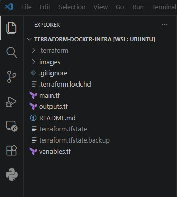
        </a><br/>
        <sub>Current structure</sub>
      </td>
     <td align="center">
        <a href="images/terraform-docker-infra_phase2_variables.jpg" target="_blank">
          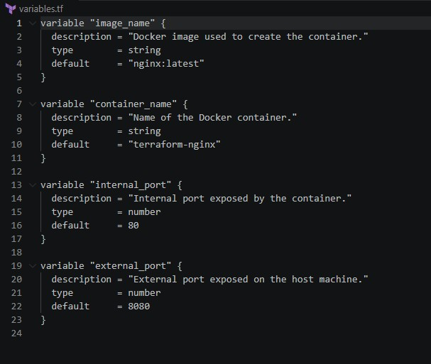
        </a><br/>
        <sub>Variables file</sub>
      </td>
     <td align="center">
        <a href="images/terraform-docker-infra_phase2_outputs.jpg" target="_blank">
          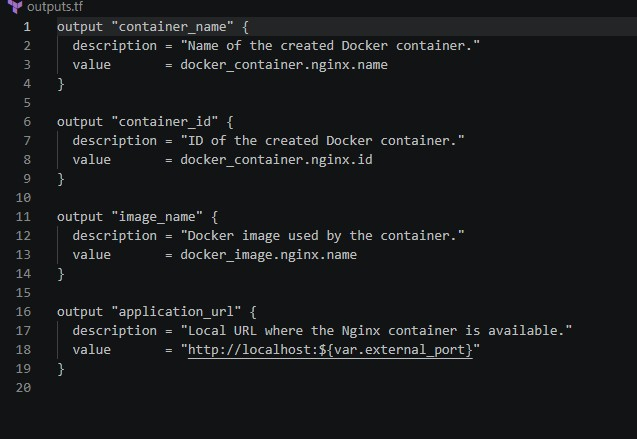
        </a><br/>
        <sub>Outputs file</sub>
      </td>
     <td align="center">
        <a href="images/terraform-docker-infra_phase2_validate.jpg" target="_blank">
          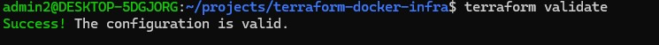
        </a><br/>
        <sub>Terraform validation</sub>
      </td>
     <td align="center">
        <a href="images/terraform-docker-infra_phase2_plan.jpg" target="_blank">
          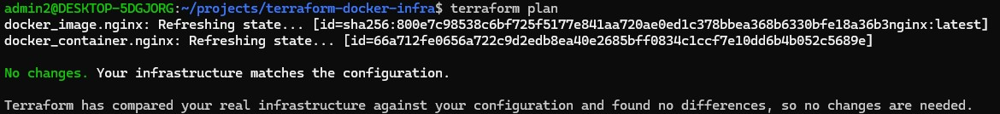
        </a><br/>
        <sub>Terraform plan</sub>
      </td>
     <td align="center">
        <a href="images/terraform-docker-infra_phase2_output.jpg" target="_blank">
          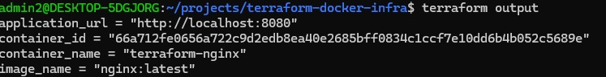
        </a><br/>
        <sub>Output</sub>
      </td>
    </tr>
  </table>
</p>

PHASE 3
<p align="center">
  <table>
    <tr>
      <td align="center">
        <a href="images/terraform-docker-infra_phase3_main.jpg" target="_blank">
          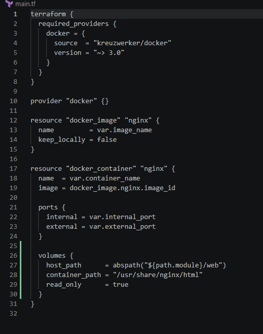
        </a><br/>
        <sub>Main.tf</sub>
      </td>
     <td align="center">
        <a href="images/terraform-docker-infra_phase3_plan.jpg" target="_blank">
          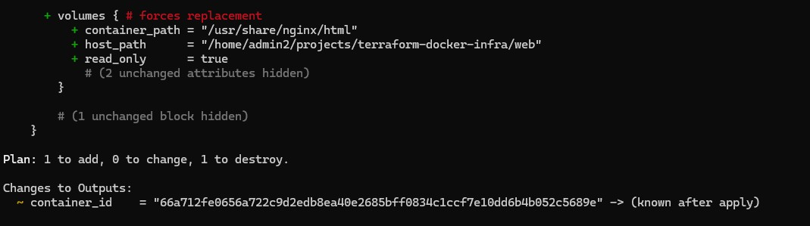
        </a><br/>
        <sub>Terraform plan</sub>
      </td>
     <td align="center">
        <a href="images/terraform-docker-infra_phase3_apply.jpg" target="_blank">
          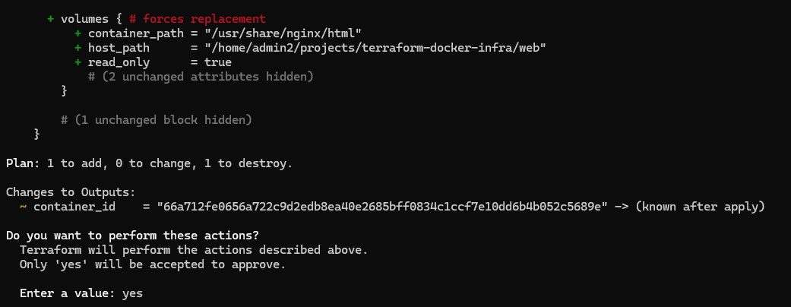
        </a><br/>
        <sub>Terraform apply</sub>
      </td>
     <td align="center">
        <a href="images/terraform-docker-infra_phase3_webpage.jpg" target="_blank">
          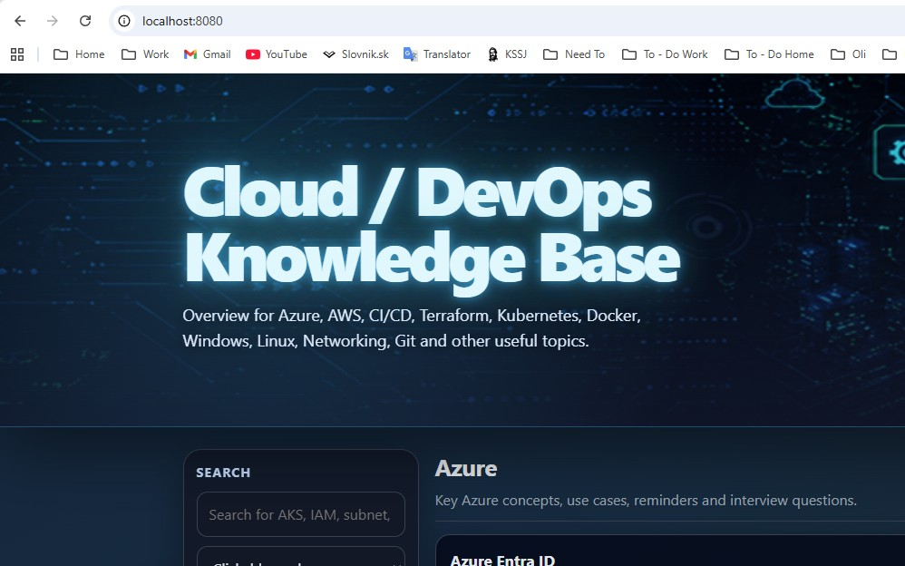
        </a><br/>
        <sub>Overview of web page</sub>
      </td>
    </tr>
  </table>
</p>

PHASE 4
<p align="center">
  <table>
    <tr>
      <td align="center">
        <a href="images/terraform-docker-infra_phase4_tfvars.jpg" target="_blank">
          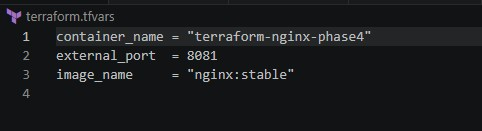
        </a><br/>
        <sub>Terraform.tfvars</sub>
      </td>
     <td align="center">
        <a href="images/terraform-docker-infra_phase4_example.jpg" target="_blank">
          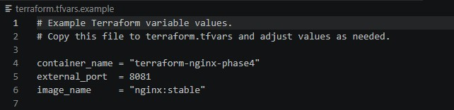
        </a><br/>
        <sub>Terraform.tfvars.example</sub>
      </td>
     <td align="center">
        <a href="images/terraform-docker-infra_phase4_plan.jpg" target="_blank">
          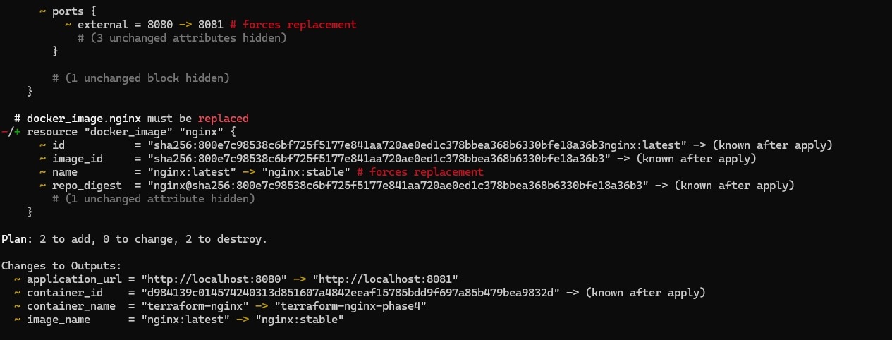
        </a><br/>
        <sub>Terraform plan</sub>
      </td>
     <td align="center">
        <a href="images/terraform-docker-infra_phase4_apply.jpg" target="_blank">
          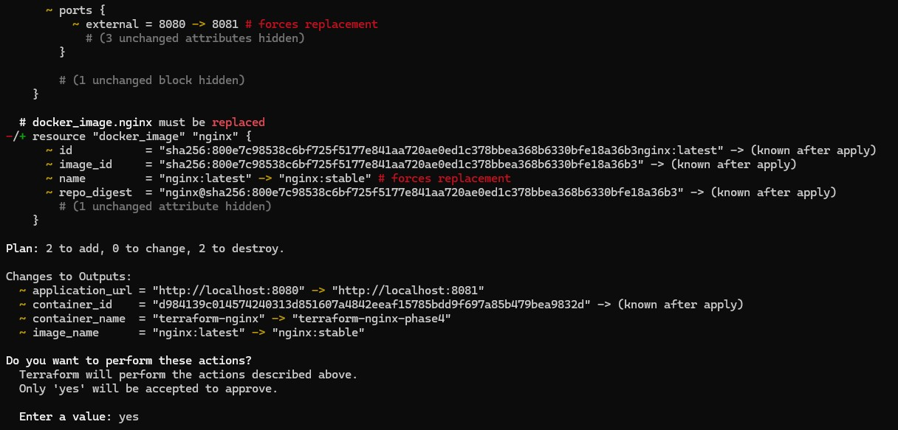
        </a><br/>
        <sub>Terraform plan</sub>
      </td>
      <td align="center">
        <a href="images/terraform-docker-infra_phase4_output.jpg" target="_blank">
          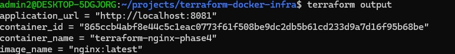
        </a><br/>
        <sub>Output</sub>
      </td>
    </tr>
  </table>
</p>
---

## 📃 Project Structure

```text
terraform-docker-infra/
├── images/
├── web/
│   └── index.html
├── .gitattributes
├── .gitignore
├── .terraform.lock.hcl
├── README.md
├── main.tf
├── variables.tf
├── outputs.tf
└── terraform.tfvars.example
```

---

## 📌 Future Improvements

- create reusable Terraform modules
- deploy multiple containers
- add GitHub Actions for Terraform validation
- improve project structure for more advanced use cases

---

## 👤 Author

Martin Tomcik  
Cloud & Infrastructure Engineer | Azure | AWS ☁️
